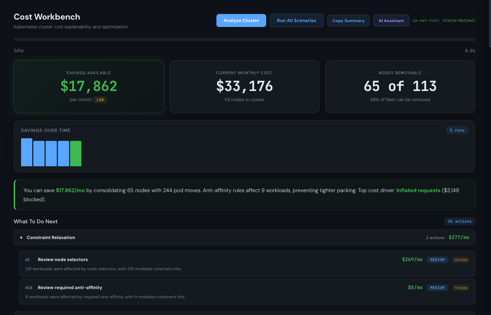
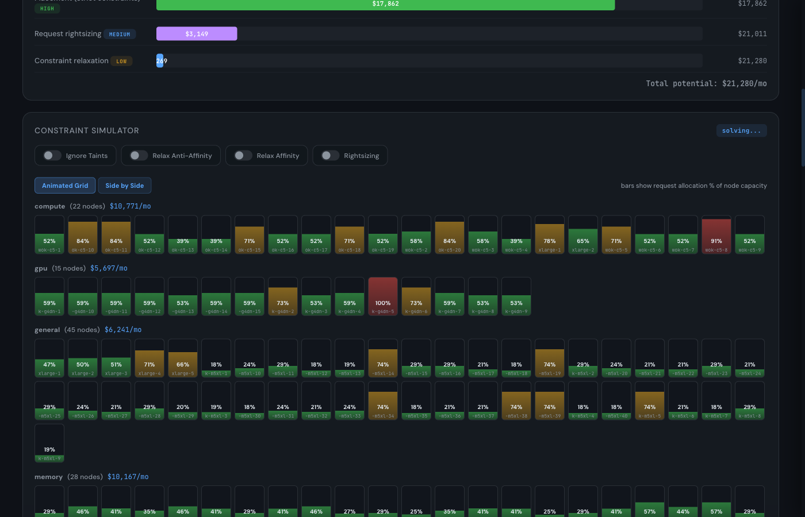

# KSolver

Kubernetes cluster cost optimizer. Connects to a live cluster (or a saved snapshot), collects every scheduling constraint, and uses [CP-SAT](https://developers.google.com/optimization/cp/cp_solver) constraint programming to find the cheapest node fleet that still satisfies all placement rules.



## What it does

KSolver answers one question: **how much are you overspending on compute, and what's blocking you from spending less?**

It collects nodes, pods, taints, affinities, anti-affinities, topology spread constraints, PDBs, node selectors, VPAs, and DaemonSets from your cluster. It feeds everything into a constraint solver that jointly optimizes placement and request levels, then shows you:

- **Dollar savings** broken down by placement consolidation, request rightsizing, and constraint relaxation
- **Ranked action items** with kubectl commands, effort badges, and risk levels
- **Constraint cost attribution** showing exactly how much each taint, affinity rule, or anti-affinity is costing you
- **Interactive constraint simulator** to toggle constraints on/off and watch nodes consolidate in real time
- **Per-node drainability** analysis showing which nodes can be emptied and what's pinned
- **Fleet recommendations** suggesting better instance types from the pricing catalog
- **VPA coverage** highlighting workloads missing VPA and estimating the waste



## Quick start

```bash
# Build
cargo build --features rust-cp-sat

# Run against your current kubeconfig
./target/debug/ksolver serve 0.0.0.0:8080

# Open the dashboard
open http://localhost:8080
```

## Helm install

```bash
helm install ksolver oci://us-central1-docker.pkg.dev/syslens-dev/syslens/ksolver \
  --version 0.5.1 \
  --namespace ksolver --create-namespace
```

## Architecture

```
ksolver/src/
  collector.rs          Kubernetes API collection (nodes, pods, VPAs, PDBs, etc.)
  model.rs              Domain types — Node, Workload, Constraint, Solution
  normalizer.rs         Normalize collected state into solver input
  optimizer_input.rs    Build CP-SAT model variables and constraints
  cpsat_rust.rs         CP-SAT solver integration via or-tools bindings
  planner.rs            Post-solve: generate moves, actions, savings waterfall
  explainability.rs     Constraint cost attribution and blocker analysis
  pricing.rs            Cloud provider instance pricing catalog
  historical_usage.rs   Prometheus-based usage collection for rightsizing
  verifier.rs           Validate solutions against kube-scheduler-simulator
  server.rs             Axum HTTP server and SSE streaming
  service.rs            Orchestrate collect -> solve -> plan pipeline
  metrics.rs            Prometheus metrics exposition
  state_cache.rs        Snapshot persistence for offline analysis
```

The solver runs as a single binary serving both the API and the single-page dashboard at `/`.

## Configuration

The dashboard exposes all solver parameters through the Advanced Settings panel. Key options:

| Parameter | Default | Description |
|-----------|---------|-------------|
| CPU/Memory Headroom | 0% | Reserve capacity on every node |
| Overcommit Ratio | 1.0 | Allow packing beyond requests (1.0 = strict) |
| Ignore Taints | off | Treat taints as soft for upper-bound analysis |
| Relax Anti-Affinity | off | Allow tighter packing by softening anti-affinity |
| Joint Rightsizing | off | Co-optimize request sizes and placement |
| Usage-Adjusted Requests | off | Replace raw requests with Prometheus-based demand |

## License

MIT
