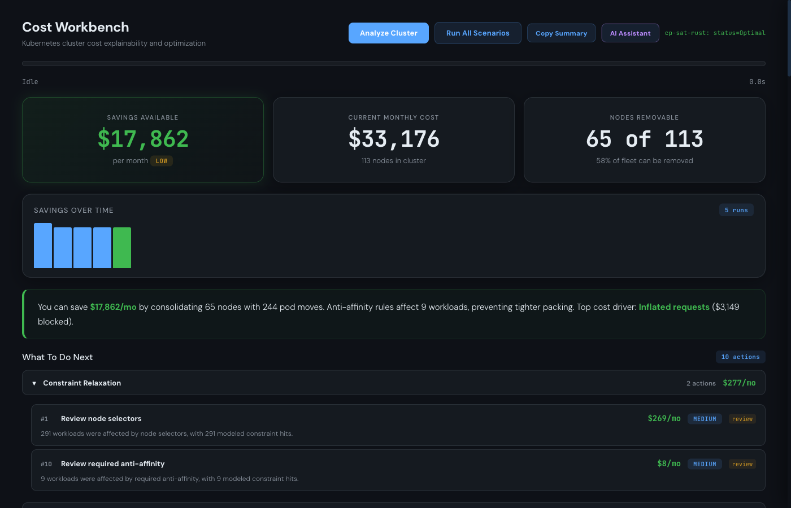
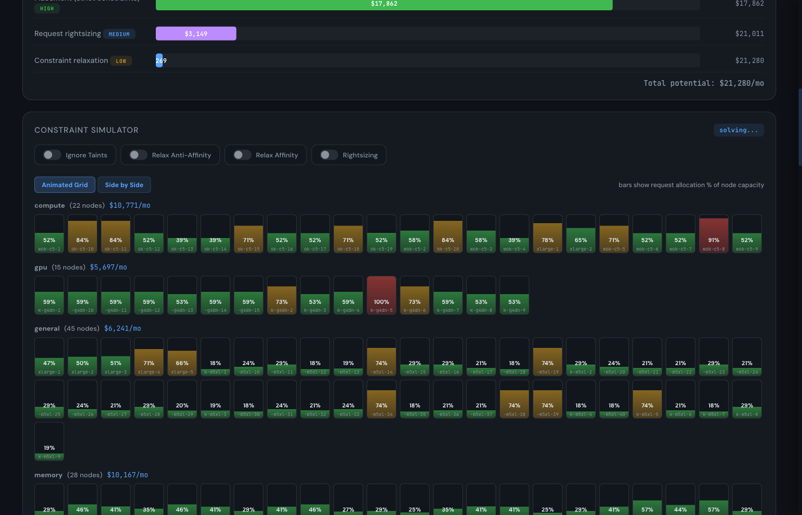

# KSolver

Kubernetes cluster cost optimizer. Connects to a live cluster (or a saved snapshot), collects every scheduling constraint, and uses [CP-SAT](https://developers.google.com/optimization/cp/cp_solver) constraint programming to find the cheapest node fleet that still satisfies all placement rules.



## What it does

KSolver answers one question: **how much are you overspending on compute, and what's blocking you from spending less?**

It collects nodes, pods, taints, affinities, anti-affinities, topology spread constraints, PDBs, node selectors, VPAs, and DaemonSets from your cluster. It feeds everything into a constraint solver that jointly optimizes placement and request levels, then shows you:

- **Dollar savings** broken down by placement consolidation, request rightsizing, and constraint relaxation
- **Ranked action items** with kubectl commands, effort badges, and risk levels
- **Constraint cost attribution** showing exactly how much each taint, affinity rule, or anti-affinity is costing you
- **Interactive constraint simulator** to toggle constraints on/off and watch nodes consolidate in real time
- **Per-node drainability** analysis showing which nodes can be emptied and what's pinned
- **Fleet recommendations** suggesting better instance types from the pricing catalog
- **VPA coverage** highlighting workloads missing VPA and estimating the waste



## Quick start

```bash
# Build
cargo build --features rust-cp-sat

# Run against your current kubeconfig
./target/debug/ksolver serve 0.0.0.0:8080

# Open the dashboard
open http://localhost:8080
```

## Helm install

```bash
helm install ksolver oci://us-central1-docker.pkg.dev/syslens-dev/syslens/ksolver \
  --version 0.5.1 \
  --namespace ksolver --create-namespace
```

## Architecture

```
ksolver/src/
  collector.rs          Kubernetes API collection (nodes, pods, VPAs, PDBs, etc.)
  model.rs              Domain types — Node, Workload, Constraint, Solution
  normalizer.rs         Normalize collected state into solver input
  optimizer_input.rs    Build CP-SAT model variables and constraints
  cpsat_rust.rs         CP-SAT solver integration via or-tools bindings
  planner.rs            Post-solve: generate moves, actions, savings waterfall
  explainability.rs     Constraint cost attribution and blocker analysis
  pricing.rs            Cloud provider instance pricing catalog
  historical_usage.rs   Prometheus-based usage collection for rightsizing
  verifier.rs           Validate solutions against kube-scheduler-simulator
  server.rs             Axum HTTP server and SSE streaming
  service.rs            Orchestrate collect -> solve -> plan pipeline
  metrics.rs            Prometheus metrics exposition
  state_cache.rs        Snapshot persistence for offline analysis
```

The solver runs as a single binary serving both the API and the single-page dashboard at `/`.

## Configuration

The dashboard exposes all solver parameters through the Advanced Settings panel. Key options:

| Parameter | Default | Description |
|-----------|---------|-------------|
| CPU/Memory Headroom | 0% | Reserve capacity on every node |
| Overcommit Ratio | 1.0 | Allow packing beyond requests (1.0 = strict) |
| Ignore Taints | off | Treat taints as soft for upper-bound analysis |
| Relax Anti-Affinity | off | Allow tighter packing by softening anti-affinity |
| Joint Rightsizing | off | Co-optimize request sizes and placement |
| Usage-Adjusted Requests | off | Replace raw requests with Prometheus-based demand |

## Shadow-mode GPU scheduler

Observes pending pods with `schedulerName: ksolver` that request GPUs, computes
where they *would* be placed, records decision traces, and **binds nothing**:

    KUBECONFIG=~/.kube/config KSOLVER_SHADOW_BATCH_SECONDS=10 \
      cargo run --features rust-cp-sat -- shadow

Environment variables:

- `KSOLVER_SHADOW_SCHEDULER_NAME` (default `ksolver`) — pods whose `spec.schedulerName` matches are in scope.
- `KSOLVER_SHADOW_BATCH_SECONDS` (default `10`) — batch window between solves.
- `KSOLVER_SHADOW_NAMESPACES` — comma-separated namespace allowlist (empty = all).
- `KSOLVER_SHADOW_GPU_RESOURCES` (default `nvidia.com/gpu`) — exact resource names counted as GPUs.
- `KSOLVER_SHADOW_ADDR` (default `127.0.0.1:8090`) — serves a live dashboard at `/` plus `/api/scheduler/traces`, `/metrics`, `/healthz`, `/readyz`. Open `http://127.0.0.1:8090/` to watch shadow decisions (placements, gangs, caveats) update live.
- `KSOLVER_SHADOW_SOLVE_SECS` (default `10`) — CP-SAT solve time budget. Shadow accepts the best incumbent within this budget rather than proving optimality; each trace shows `solve_core_millis` (solver-only time) and `solver_status` (Feasible vs Optimal). Effective cadence is roughly `batch window + snapshot collection + solve`.
- `KSOLVER_SHADOW_QUOTAS` (default none) — per-namespace GPU quotas as `ns=cap` pairs, e.g. `KSOLVER_SHADOW_QUOTAS="team-a=200,team-b=300"`. A namespace over its cap gets only as many pending pods admitted as fit under the remaining quota (`cap − GPUs already used by its running pods`, clamped ≥ 0); the rest are reported unplaced with a "capacity or quota" reason. Namespaces without a configured quota are unconstrained. Enforced only in the shadow (partial-admission) path.

Best-effort pod anti-affinity is modeled for `requiredDuringScheduling` terms with `matchLabels` (no `matchExpressions`, same namespace) across **any topology key** — `kubernetes.io/hostname` excludes the exact node; `topology.kubernetes.io/zone`, a rack label, etc. exclude the whole topology *domain* that already holds a matching pod (pending-vs-running, both directions). Terms we can't fully model are still surfaced as a "pod anti-affinity" caveat on the decision.

Shadow mode issues only read/watch/list. Minimal RBAC (read-only):

```yaml
apiVersion: rbac.authorization.k8s.io/v1
kind: ClusterRole
metadata:
  name: ksolver-shadow-readonly
rules:
  - apiGroups: [""]
    resources: [pods, nodes, persistentvolumeclaims, persistentvolumes]
    verbs: [get, list, watch]
  - apiGroups: ["apps"]
    resources: [daemonsets, deployments]
    verbs: [get, list, watch]
  - apiGroups: ["storage.k8s.io"]
    resources: [storageclasses]
    verbs: [get, list, watch]
  - apiGroups: ["policy"]
    resources: [poddisruptionbudgets]
    verbs: [get, list, watch]
```

It grants no `create`/`update`/`patch`/`delete` and no `pods/binding` — shadow
mode cannot mutate the cluster even if a bug tried to.

## Feasibility conformance

`ksolver conform` checks that our node-feasibility logic agrees with the real kube-scheduler
Filter phase. For each pending pod and each (non-cordoned) node it gets two verdicts — ours
(`feasible_on_node`) and the scheduler's — and reports every disagreement:

    KSOLVER_SCHEDULER_SIMULATOR_URL=http://localhost:8080 \
      ksolver conform --sample 20 --cluster my-cluster

- The scheduler verdict comes from [kube-scheduler-simulator](https://github.com/kubernetes-sigs/kube-scheduler-simulator): we import a snapshot with exactly **one node** (empty of other pods) plus the pod; the pod binding to that node means Filter passed, unschedulable means it failed. One node isolates Filter from Score.
- Both sides test raw allocatable (empty node), so DaemonSet-reserve/overcommit/headroom — separate ksolver layers, not Filter predicates — don't skew the comparison.
- Pods carrying constructs we intentionally don't model (pod affinity/anti-affinity, `DoNotSchedule` topology spread, priority, `matchFields` node affinity) are bucketed as **expected divergence**; only plain pods must match exactly. `FALSE-POSITIVE` results (we say feasible, the scheduler rejects) are listed first — those are the dangerous ones.
- Read-only on the real cluster; only the simulator (a sandbox) is scheduled against. With no simulator URL configured, `conform` prints a skip notice and exits 0.

## License

MIT
